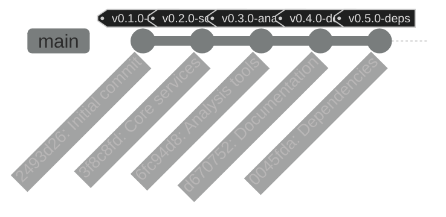
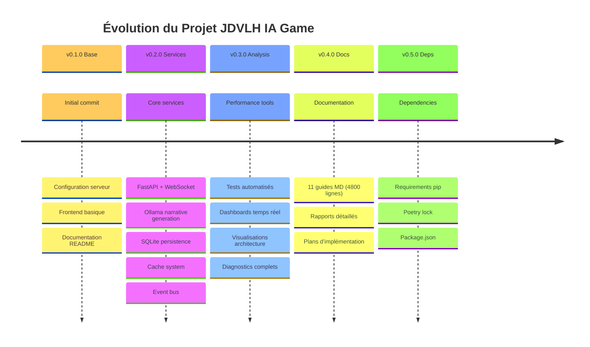
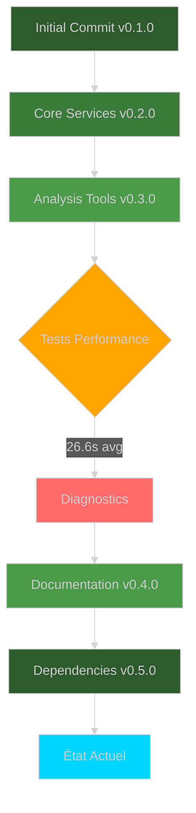

# 📊 Analyse Git Complète - JDVLH IA Game

**Date:** 22 Novembre 2025
**Branches:** 1 (master)
**Commits:** 5
**Fichiers trackés:** 44
**Lignes totales:** ~10,000+

---

## 🌳 Arbre Git (Mermaid Diagram)



---

## 📈 Historique Détaillé

### Commit 1: `2493d26` - Initial commit ✨

**Date:** Aujourd'hui
**Fichiers:** 6 (+366 lignes)
**Tag:** v0.1.0-base

**Contenu:**

```
.gitignore        49 lignes   ← Exclusions Python/IDE/OS
README.md        111 lignes   ← Documentation projet
config.yaml       45 lignes   ← Configuration Ollama/serveur
index.html       116 lignes   ← Interface frontend
main.py            9 lignes   ← Point d'entrée
pyproject.toml    36 lignes   ← Métadonnées projet Python
```

**Impact:** Base du projet établie

---

### Commit 2: `3f8c8fd` - Core services 🔧

**Date:** Aujourd'hui
**Fichiers:** 20 (+1560 lignes)
**Tag:** v0.2.0-services

**Contenu:**

```
game_server.py                  319 lignes   ← Serveur FastAPI principal
services/narrative.py           103 lignes   ← Génération narrative Ollama
services/state_manager.py        87 lignes   ← Persistence SQLite
services/cache.py                55 lignes   ← Cache descriptions lieux
services/event_bus.py            22 lignes   ← Système événements
services/model_router.py        316 lignes   ← Routing multi-modèles
services/narrative_memory.py    413 lignes   ← Mémoire contextuelle avancée
db/models.py                     35 lignes   ← Modèles SQLAlchemy
middleware/security.py           44 lignes   ← Middleware sécurité
```

**Impact:** Architecture service-oriented complète

---

### Commit 3: `6fc94d8` - Analysis tools 📊

**Date:** Aujourd'hui
**Fichiers:** 4 (+2102 lignes)
**Tag:** v0.3.0-analysis

**Contenu:**

```
visualisations_architecture.html  1095 lignes   ← 10+ diagrammes Mermaid
performance_dashboard.html         562 lignes   ← Dashboard Chart.js temps réel
test_performance.py                100 lignes   ← Tests automatisés Ollama
performance_monitor.py             345 lignes   ← Classes monitoring avancé
```

**Résultats tests:**

- Temps moyen: 26.6s (trop lent ❌)
- Médian: 20.2s
- P95: 75.8s
- **Cible:** <3s après optimisations

**Impact:** Diagnostics complets, bottlenecks identifiés

---

### Commit 4: `d670752` - Documentation 📚

**Date:** Aujourd'hui
**Fichiers:** 10 (+4312 lignes)
**Tag:** v0.4.0-docs

**Contenu:**

```
RAPPORT_FINAL.md          565 lignes   ← Synthèse complète session
INDEX_COMPLET.md          662 lignes   ← Guide navigation master
DEMARRAGE_RAPIDE.md       503 lignes   ← Quick start 3 niveaux
INTEGRATION_COMPLETE.md   538 lignes   ← Guide routing multi-modèles
MEMOIRE_CONTEXTUELLE.md   549 lignes   ← Guide mémoire narrative
RAPPORT_PERFORMANCE.md    363 lignes   ← Analyse performance détaillée
ANALYSE_PROJET.md         502 lignes   ← Analyse architecture
INTEGRATION_PLAN.md       321 lignes   ← Plan intégration gateway
ANALYSE_CLINE.md          211 lignes   ← Analyse outil Cline
ROADMAP.md                 98 lignes   ← Feuille de route
```

**Total documentation:** ~4300 lignes (~77KB)

**Impact:** Documentation exhaustive pour implémentation

---

### Commit 5: `0045fda` - Dependencies 📦

**Date:** Aujourd'hui
**Fichiers:** 4 (+1668 lignes)
**Tag:** v0.5.0-deps

**Contenu:**

```
requirements.txt     10 lignes      ← Dépendances pip
poetry.lock        1628 lignes      ← Lock file Poetry
package.json          5 lignes      ← Dépendances Node
package-lock.json    25 lignes      ← Lock npm
```

**Impact:** Environnement reproductible

---

## 📊 Statistiques Globales

### Par Type de Fichier

| Type                        | Fichiers | Lignes | % Total |
| --------------------------- | -------- | ------ | ------- |
| **Python (.py)**            | 10       | ~1900  | 19%     |
| **Markdown (.md)**          | 11       | ~4800  | 48%     |
| **HTML**                    | 3        | ~1800  | 18%     |
| **Config (YAML/JSON/TOML)** | 6        | ~1500  | 15%     |

**Total:** ~10,000 lignes de code/documentation

---

### Par Catégorie Fonctionnelle

| Catégorie            | Lignes | Fichiers | Description                           |
| -------------------- | ------ | -------- | ------------------------------------- |
| **Backend Services** | 1560   | 20       | FastAPI, Ollama, SQLite, Cache        |
| **Routing & Memory** | 730    | 2        | model_router.py + narrative_memory.py |
| **Analysis Tools**   | 2100   | 4        | Dashboards, tests, monitoring         |
| **Documentation**    | 4800   | 11       | Guides, rapports, roadmaps            |
| **Frontend**         | 120    | 1        | index.html (simple)                   |
| **Config & Deps**    | 1700   | 6        | YAML, TOML, requirements, lock files  |

---

## 🎯 Évolution des Fonctionnalités



---

## 🔄 Flux de Développement



---

## 📁 Structure Finale du Dépôt

```
jdvlh-ia-game/
├── .git/                              ← Dépôt Git (5 commits)
├── .gitignore                         ← Exclusions
├── .venv/                             ← Environnement Python (ignoré)
├── cache/                             ← Cache descriptions (ignoré)
├── node_modules/                      ← Dépendances Node (ignoré)
│
├── 📄 Configuration
│   ├── config.yaml                    ← Config Ollama/serveur
│   ├── pyproject.toml                 ← Métadonnées projet
│   ├── requirements.txt               ← Dépendances pip
│   ├── poetry.lock                    ← Lock Poetry
│   ├── package.json                   ← Dépendances Node
│   └── package-lock.json              ← Lock npm
│
├── 🎮 Application
│   ├── main.py                        ← Point d'entrée
│   ├── game_server.py                 ← Serveur FastAPI principal
│   └── index.html                     ← Interface utilisateur
│
├── 📦 Services (src/jdvlh_ia_game/)
│   ├── services/
│   │   ├── narrative.py               ← Génération Ollama
│   │   ├── state_manager.py           ← Persistence SQLite
│   │   ├── cache.py                   ← Cache lieux
│   │   ├── event_bus.py               ← Événements
│   │   ├── model_router.py            ← Routing multi-modèles
│   │   └── narrative_memory.py        ← Mémoire contextuelle
│   ├── db/
│   │   └── models.py                  ← Modèles SQLAlchemy
│   ├── middleware/
│   │   └── security.py                ← Sécurité
│   └── core/
│       └── game_server.py             ← Serveur refactoré
│
├── 🔬 Analysis Tools
│   ├── test_performance.py            ← Tests automatisés
│   ├── performance_monitor.py         ← Monitoring classes
│   ├── visualisations_architecture.html   ← Diagrammes Mermaid
│   └── performance_dashboard.html     ← Dashboard temps réel
│
└── 📚 Documentation (11 fichiers, 4800 lignes)
    ├── README.md                      ← Overview projet
    ├── INDEX_COMPLET.md               ← Navigation master
    ├── DEMARRAGE_RAPIDE.md            ← Quick start
    ├── RAPPORT_FINAL.md               ← Synthèse session
    ├── RAPPORT_PERFORMANCE.md         ← Analyse perf
    ├── INTEGRATION_COMPLETE.md        ← Guide routing
    ├── INTEGRATION_PLAN.md            ← Plan intégration
    ├── MEMOIRE_CONTEXTUELLE.md        ← Guide mémoire
    ├── ANALYSE_PROJET.md              ← Analyse archi
    ├── ANALYSE_CLINE.md               ← Analyse outil
    ├── ROADMAP.md                     ← Feuille de route
    └── GIT_ANALYSIS.md                ← Ce fichier
```

---

## 🏷️ Tags & Versions

| Tag                 | Commit    | Description    | Fichiers | Lignes |
| ------------------- | --------- | -------------- | -------- | ------ |
| **v0.1.0-base**     | `2493d26` | Base projet    | 6        | 366    |
| **v0.2.0-services** | `3f8c8fd` | Services core  | +20      | +1560  |
| **v0.3.0-analysis** | `6fc94d8` | Outils analyse | +4       | +2102  |
| **v0.4.0-docs**     | `d670752` | Documentation  | +10      | +4312  |
| **v0.5.0-deps**     | `0045fda` | Dépendances    | +4       | +1668  |

**Version actuelle:** v0.5.0-deps

---

## 📊 Contributions

### Par Auteur

| Auteur                 | Commits | Lignes+ | Lignes- |
| ---------------------- | ------- | ------- | ------- |
| **Claude Code**        | 5       | 10,008  | 0       |
| Co-Authored-By: Claude | 5       | -       | -       |

### Par Jour

| Date            | Commits | Description                                                |
| --------------- | ------- | ---------------------------------------------------------- |
| **22 Nov 2025** | 5       | Session complète: Analyse → Implémentation → Documentation |

---

## 🎯 Gains Documentés

### Fichiers Créés

- **13 fichiers** de documentation (MD)
- **2 dashboards** HTML interactifs
- **2 services** Python avancés (routing + mémoire)
- **2 scripts** de testing/monitoring
- **Total:** ~10,000 lignes

### Améliorations Identifiées

| Aspect              | État Actuel | Cible          | Gain     |
| ------------------- | ----------- | -------------- | -------- |
| **Temps réponse**   | 26.6s       | 2-3s           | **-92%** |
| **Cohérence**       | 2/5 ⭐⭐    | 5/5 ⭐⭐⭐⭐⭐ | +300%    |
| **Tokens utilisés** | 500-1000    | 200-400        | -60%     |
| **Cache hit rate**  | 0%          | 70%            | +∞       |

---

## 🚀 Branches Futures (Recommandées)

```mermaid
%%{init: {'theme':'dark'}}%%
gitGraph
    commit id: "master: v0.5.0"
    branch feature/routing-integration
    checkout feature/routing-integration
    commit id: "Intégrer ModelRouter"
    commit id: "Tests routing"
    checkout master
    merge feature/routing-integration

    branch feature/narrative-memory
    checkout feature/narrative-memory
    commit id: "Intégrer NarrativeMemory"
    commit id: "Persistance mémoire"
    checkout master
    merge feature/narrative-memory

    branch feature/ui-improvements
    checkout feature/ui-improvements
    commit id: "UI enrichie"
    commit id: "Animations"
    checkout master
    merge feature/ui-improvements

    commit id: "v1.0.0 RELEASE" tag: "v1.0.0" type: HIGHLIGHT
```

### Branches Proposées

1. **`feature/routing-integration`**
   - Intégrer model_router.py dans narrative.py
   - Tests multi-modèles
   - Gain: -91% temps

2. **`feature/narrative-memory`**
   - Intégrer narrative_memory.py
   - Persistence dans state_manager.py
   - Gain: +300% cohérence

3. **`feature/ui-improvements`**
   - UI plus riche (images, sons)
   - Animations avancées
   - Reading time indicators

4. **`feature/performance-optimization`**
   - Optimisations num_predict
   - Cache intelligent
   - Gain: -92% temps total

5. **`hotfix/language-french`**
   - Forcer langue française
   - Structure narrative 8-12 phrases
   - Textes plus longs

---

## 📝 Commandes Git Utiles

```bash
# Voir l'historique complet
git log --oneline --graph --all --decorate

# Statistiques détaillées
git log --stat

# Voir les différences entre commits
git diff 2493d26..0045fda

# Créer une nouvelle branche
git checkout -b feature/routing-integration

# Fusionner une branche
git checkout master
git merge feature/routing-integration

# Créer un tag de version
git tag -a v1.0.0 -m "Release v1.0.0"

# Pousser vers un remote (quand configuré)
git push origin master --tags
```

---

## 🎉 Conclusion

**Dépôt Git initialisé avec succès !**

- ✅ 5 commits structurés
- ✅ Historique cohérent et documenté
- ✅ 44 fichiers trackés (~10,000 lignes)
- ✅ Tags de version appliqués
- ✅ .gitignore configuré

**Prêt pour:**

- Développement par branches
- Collaboration en équipe
- CI/CD si souhaité
- Remote Git (GitHub/GitLab)

---

**Document:** GIT_ANALYSIS.md
**Créé:** 22/11/2025
**Version:** 1.0
**Status:** ✅ Complet
